# ORKA – Engineering Devlog

  <picture>
    <source media="(prefers-color-scheme: dark)" srcset="assets/logo/ORKA_logo_white.png">
    <source media="(prefers-color-scheme: light)" srcset="assets/logo/ORKA_logo_black.png">
    
  </picture>

> **ORKA** = Omnidirektionaler Roboter mit Kameragestützter Autonomie

> Hardware:  
> Raspberry Pi 5 (8GB) + Hailo-8L M.2 HAT (13 TOPS) · ESP32 · TB6612FNG · YOLOv8 · PETG-Chassis (3D-Druck)

---

## 2026-03-06 – Erste Motorsteuerungsversuche & Architekturentscheidung

**Ziel**
- ESP32 einrichten, erste Motorsteuerung mit TB6612FNG aufbauen
- Systemarchitektur für die Motorsteuerung festlegen.

**Vorgehensweise**
- Arduino IDE installiert, ESP32 DevKit eingerichtet, ersten Testcode geflasht
- Breadboard-Prototyp mit TB6612FNG aufgebaut
- Stromversorgung für ESP32 DevKit über Powerpack (USB-A auf Micro USB)
- Stromversorgung für DC Gear Motors über Powerpack: altes USB-A Kabel aufgeschnitten und direkt mit Breadboard verbunden

 

<h3><strong><u>📸 Fotos anzeigen</u></strong></h3>

 

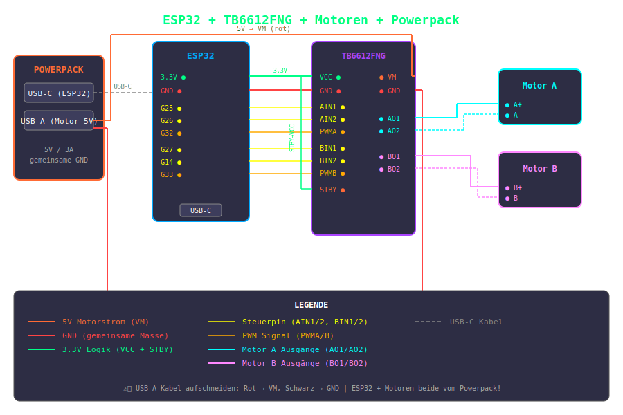
 
<em>Erste Verkabelungsidee: 5V an VM, alte Pin-Belegung (G25/26/32)</em>

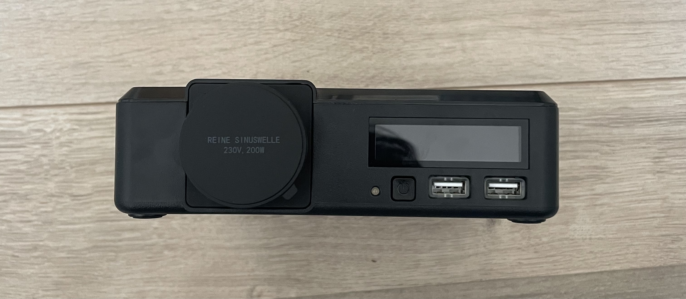
 
<em>Powerpack Frontalansicht — AC-Ausgang 200W + 2 x USB-A Port (5V/3A) </em>

 

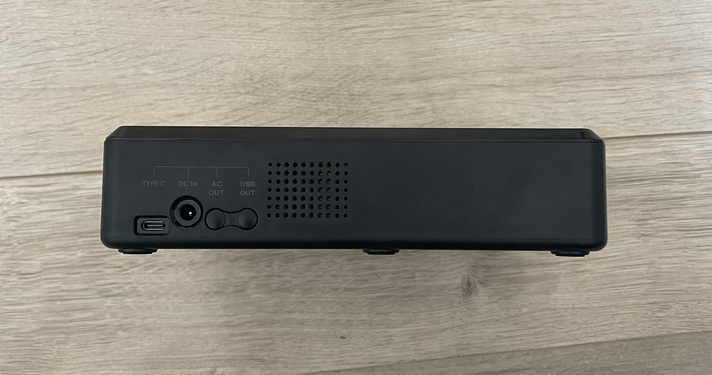
 
<em>Powerpack Seitenansicht — USB-C Port (5-20V/3A)</em>

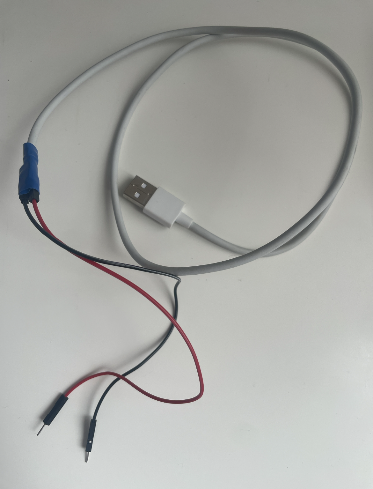
 
<em>USB-A Kabel aufgeschnitten: rot = 5V, schwarz = GND — direkt ans Breadboard angeschlossen</em>

 

 

**Probleme**
- Der Motor ließ sich nicht ansteuern
  
  > Vermutung: Entweder liegt ein Fehler in der Verkabelung des Motortreibers vor, oder die gewünschte Spannung wird erst nach einer entsprechenden Anfrage über USB Power Delivery bereitgestellt
- Powerpack liefert über USB-C PD erst nach expliziter Spannungsanforderung die gewünschte Spannung – kein automatischer 12-V-Output

**Lösungen**
- Referenz für die Verkabelung des TB6612FNG-Motortreibers auf GitHub gesucht
- Mehrere YouTube Tutorials zur TB6612FNG Verkabelung angesehen  
- USB-C PD Trigger Kabel bestellt (fordert automatisch 15V an → Step-Down auf 12V für Motoren)
- Expansion Board für das ESP32 DevKit bestellt, um das Breadboard zu ersetzen
- Für den Fall, dass weitere Sensoren angeschlossen werden sollen, wurde ein zweites ESP32 DevKit bestellt

- Architekturentscheidung: Motorsteuerung läuft auf ESP32 DevKit, nicht direkt auf Raspberry Pi
  - Begründung: Mikrocontroller reagiert deterministischer als Linux-System bei zeitkritischer Motorsteuerung
  - ESP32 kann Arduino-Sensoren direkt anbinden
  - Raspberry Pi bleibt für Bildverarbeitung und YOLOv8 zuständig

**Erkenntnis**
- USB-C PD verhält sich nicht wie eine einfache Spannungsquelle — Protokoll-Handshake notwendig
- Klare Aufgabentrennung ESP32/Pi von Anfang an sinnvoll

**Ausblick**
- PD Trigger Kabel + Expansion Board abwarten
- Motor-Test mit sauberer Verkabelung wiederholen

---

## 2026-03-07 – Räder, Clip-System & erste Robotergehäuse-Konzepte

**Ziel**
- Räder für 3D-Druck erstellen 
- Erste Iterationen eines Clip-Systems für Radkappen entwickeln  
- Start der Überlegungen für das Robotergehäuse
  

**Probleme**
- Vertikal gedruckte Clips zeigen eine schwache Layerhaftung → Belastung quer zur Layer-Richtung führt zu Bruchanfälligkeit
- Gehäuseerstellung schwierig, da Endgröße, Motorposition, Sensoranzahl, Powerpack-Layout noch unklar
  
**Lösungen**
- Gridfinity Generator genutzt, um standardisierte Gridfinity Baseplate (248×248 mm) zu erzeugen  
- Erste Idee: Baseplate einfach eine komplette Platte drucken, darauf Stützen für Wände platzieren und darauf Gridfinity Baseplate befestigen
- Grund für modularen Ansatz: Basis-Module sollen austauschbar bleiben → spätere Änderungen bei Motoren, Sensorik oder Powerpack möglich  
- Grobe Überlegung: Wände über seitliches Schienensystem von oben einsetzbar machen, Deckel fixiert die Wände  
- Deckel als obere Abdeckung vorgesehen 
  
**Vorgehensweise**
- CAD Modelle erstellen und zusammensetzen → Schauen ob Vorstellungen funktionieren
- Strategie: 3D-Druck parallel zur Entwicklung laufen lassen, um möglichst viele Iterationen früh testen zu können  

**Ausblick**
- Überlegen, wie Wände, Stützen und Deckel stabil umgesetzt werden können  
- Druckgrößen und Toleranzen prüfen, erste CAD-Tests der Basis-Module durchführen
  
## 2026-03-08 – Robotergehäuse-Design & Baseplate Pain-Points

**Ziel**
- Weiterentwicklung des Gehäuse-Konzepts für den Roboter (Robofinity)  
- Fokus: austauschbare Gridfinity-Baseplate, einfache Wartung, flexible Anpassungen

**Vorgehensweise**
- CAD-Design der Baseplate mit ersten Corner- und Middle-Pieces begonnen  
- Gridfinity-Baseplate austauschbar/herausnehmbar gestalten, um Zugriff auf Elektronik und Sensoren zu erleichtern  
- Erste Konzepte im Kopf: Gridfinity-Baseplate fest montieren, aber gleichzeitig Zugang zum Boden für Sensoren ermöglichen  

**Probleme**
- Corner/Middle-Pieces sind fest mit Baseplate verbunden → jede Höhenänderung erfordert Neudruck
- Sensoren am Boden (z. B. IR-Sensor gegen Abstürze) → Löcher an richtiger Stelle nötig → hoher Filamentverbrauch bei Anpassungen
- Herausforderung: Baseplate modular genug halten, um spätere Änderungen an Höhe, Sensorik, Motoranordnung oder Roboterfläche zu ermöglichen  

**Lösungen**
- Corner/Middle-Pieces an und ab montierbar machen → Höhe des Gehäuses häng von diesen ab → Baseplate muss nicht dafür neu gedruckt werden 
  
**Erkenntnisse**
- Modularer Ansatz notwendig: Gridfinity-Baseplate abnehmbar, Corner/Middle-Pieces fix → erleichtert Wartung und iterative Anpassungen  
- Stabilität bleibt Priorität, daher keine komplett austauschbaren Stützen  

**Ausblick**
- Konzept für Corner/Middle-Pieces und Gridfinity-Baseplate weiter konkretisieren  
- Überlegen, wie Höhenanpassungen und Sensorpositionen flexibel umgesetzt werden können  
- Erste CAD-Tests der Basis-Module durchführen

## 2026-03-09 – Hybrid-Lösung: DIN-Schienen + Gridfinity

**Ziel**
- Befestigung austauschbarer Gridfinity-Tiles an Wänden, die weiterhin im Gridfinity-System verwendet werden können  
- Modularität für spätere Anpassungen an Höhe, Sensorik oder Motoren  

**Vorgehensweise**
- Entscheidung für DIN-Schienen für die Wände getroffen  
  - Andere Systeme (T-Schienen, Gitter an Wänden) geprüft und verworfen  
- Corner- und Middle-Pieces der Baseplate weiter angepasst, iterativ verbessert  
- PETG als Material gewählt für Stabilität und UV-Resistenz  
- Überlegung: Gridfinity-Baseplate austauschbar halten, Fixierung über Heat Inserts direkt an Baseplate vorgesehen  
- Heat Inserts bestellt, um Befestigungen sauber und wiederholbar zu realisieren  
- Idee: Gridfinity-Tile mit Wand (DIN-Schiene) verbinden → erste Hybrid-Struktur konzipiert  

**Probleme**
- Befestigung der Wände stabil und gleichzeitig modular gestalten  
- Zugriff auf Elektronik weiterhin einfach über austauschbare Gridfinity-Baseplate; Befestigung an der Wand möglich  
- Höhe, Sensorposition und Motorplatzierung noch nicht final → Konzept muss flexibel bleiben  
- PETG haftet zu stark an Druckbett

**Lösungen**
- Klebestift auf Druckbett genutzt, damit PETG nicht zu stark haftet  

**Erkenntnisse**
- DIN-Schienen-Lösung pragmatisch, einfach umzusetzen und stabil  
- Lösung bietet hohe Stabilität; maximale Höhe der Schiene für Befestigung bleibt bei ca. 3 mm, ausreichend für sichere Fixierung  
- Konzept zeigt, wie Modularität und Stabilität kombiniert werden können  

**Ausblick**
- CAD-Umsetzung der Hybrid-Struktur starten  
- Druck- und Toleranztests vorbereiten  
- Heat Inserts in CAD einplanen, Fixierung der Wände testen

## 2026-03-10 – Heat Inserts, Corner Pieces 

**Ziel**
- Befestigungen der DIN-Schienen / Corner- und Middle-Pieces zuverlässig gestalten  
- Sicherstellen, dass Baseplate und modulare Komponenten stabil montiert werden können

**Vorgehensweise**
- Heat Inserts Set (5 mm Durchmesser) bestellt  
- Ursprünglich Löcher für 4 mm geplant, mussten nachträglich angepasst werden  
- Corner- und Middle-Pieces getestet, Passform überprüft  
- Bohrungen für Heat Inserts angepasst: 4,5 mm Bohraufsatz verwendet für perfekte Passform  
- Sandstrahler eingerichtet, um bei Bedarf Oberflächen der Druckteile sauber zu bearbeiten  
- Druck der Corner/Middle-Pieces in PETG geplant und vorbereitet  

**Probleme**
- Ursprüngliche Planung: 3.5 mm Bohrungen → Heat Inserts (5 mm) passten nicht  

**Lösungen**
- Löcher präzise aufgebohrt, Heat Inserts eingesetzt → saubere und wiederholbare Befestigung  

**Erkenntnisse**
- Heat Inserts ermöglichen zuverlässige Montage und modularen Aufbau  
- Sandstrahler vorbereitet → bei Bedarf Nachbearbeitung der Teile möglich  

**Ausblick**
- Baseplate inkl. DIN-Schienen montieren

## 2026-03-11 – Roboterarm-Recherche

**Ziel**
- Auswahl eines passenden Roboterarms (6-DOF, 3D-druckbar, kompatibel mit bestehender Elektronik)  
- Evaluierung von mechanischen, elektrischen und Software-Anforderungen  

**Vorgehensweise**
- Verschiedene Roboterarme recherchiert (open-source, 3D-druckbar, gute Dokumentation und Community-Support)  
- Kriterien definiert:  
  - 6 Freiheitsgrade (6-DOF)  
  - Kompatibilität mit ESP32 / Raspberry Pi Steuerung  
  - Einfacher Druck und Montage  
  - Support / Community-Ressourcen für Anpassungen  

**Probleme**
- Kein Roboterarm erfüllte alle Kriterien perfekt  
- Abwägung zwischen mechanischer Stabilität, Größe, Gewicht und Druckbarkeit  
- Unsicherheit über endgültige Sensorik / Greifer → Arm muss später ggf. angepasst werden  

**Lösungen**
- Vorläufige Favoritenliste erstellt, aber keine finale Wahl getroffen  
- Fokus auf Flexibilität: Arm muss später an Änderungen im Roboter angepasst werden können  

**Erkenntnisse**
- Roboterarm-Auswahl hängt stark von zukünftiger Sensorik, Motoren und Greifer ab  
- Geduld bei der Wahl sinnvoll, um spätere Iterationen nicht einzuschränken  
- Gute Dokumentation und Community-Support sind entscheidende Kriterien  

**Ausblick**
- Weiter beobachten, welche Arme in Community / Open-Source Projekten gut dokumentiert sind  
  
## 2026-03-12 – Motor-Tests, PD-Kabel & Löt-Erfahrung (TB6612FNG)

**Ziel**
- Testen der DC-Motoren mit ESP32 über TB6612FNG  
- Sicherstellen, dass Motoren korrekt angesteuert werden können  

**Vorgehensweise**
- ESP32 verkabelt, Motorcontroller angeschlossen  
- Powerpack (12V) als Stromversorgung genutzt  
- PD-Kabel für Spannungsversorgung getestet:  
  - Noch keinen Adapter für PD-Kabel vorhanden  
  - Zweites ESP32 Expansion Board angeschlossen, Jumper entfernt  
  - Zwei Kabel direkt an PD-Port angeschlossen → Spannung erfolgreich genutzt  
  - Grob / klobig, aber funktionierte zuverlässig  
- Erste Lötversuche: **Pins des TB6612FNG direkt festgelötet** → Kontaktproblem gelöst  
- Nachmessen durchgeführt, Motor lief dennoch nicht korrekt  
- Entscheidung getroffen, Lötflux und Lötstation zu besorgen → bessere Lötergebnisse und stabilere Kontakte.    

 

<h3><strong><u>📸 Fotos anzeigen</u></strong></h3>

 

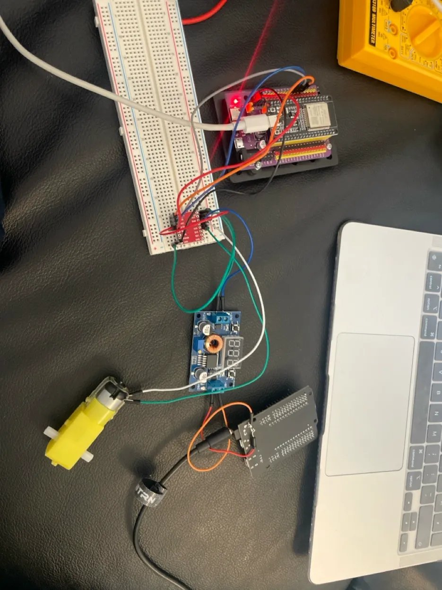
 
<em>ESP32 auf Expansion Board, TB6612FNG auf Breadboard, Step-Down Modul, DC Motor</em>

 

**Probleme**
- Kurzschluss beim Messen am Powerpack → ein ESP32 „explodiert“  
- Mit zweitem ESP32 weitergearbeitet ist jedoch extrem heiß geworden, Fehlerursache unklar → evtl. Treiber beschädigt beim Löten  
- PD-Kabel-Lösung improvisiert, klobig
- Erstes Löten der Pins → mögliche Treiber-Schäden  

**Lösungen**
- 3 neue ESP32 bestellt, um defekte Boards zu ersetzen  
- Stromversorgung prüfen: Multimeter zur Kontrolle, keine Messungen unter Last mehr  
- Schrittweises Testen empfohlen → nur eine Komponente gleichzeitig anschließen  
- Provisorische PD-Kabel-Lösung genutzt → funktionierte zuverlässig, später Adapter geplant  
- Lötstation + Lötflux besorgt → zukünftig stabilere und saubere Lötverbindungen  

**Erkenntnisse**
- Kurzschluss und Überhitzung zeigen, dass Powerpack und Verkabelung kritisch sind  
- Debugging in kleinen Schritten deutlich effizienter  
- Sicherheit bei Strommessungen wichtig, Thermal Runaway früh erkennen  
- Lehrgeld: 3 ESP32 ~15 € insgesamt, aber wertvolle Erfahrung für zukünftige Fehlervermeidung  

**Ausblick**
- Motor-Treiber Setup und Verkabelung final prüfen  
- Iterative Tests mit neuen ESP32 durchführen

## 2026-03-13 – Robotergehäuse-System / Robofinity überarbeitet

**Ziel**
- Modularität und Stabilität der Roboter-Basis (Robofinity) verbessern  

**Vorgehensweise**
- Connectoren an Wänden eingefügt, damit mehrere Module nebeneinander verbunden werden können  
- Corner- und Middle-Pieces der Baseplate überprüft und angepasst  
- Fokus auf saubere Verbindung der Wände, Modularität und einfache Montage  

**Probleme**
- Connectoren können bei festen Wänden Probleme verursachen, wenn Höhe oder Toleranzen variieren  

**Erkenntnisse**
- Modularer Ansatz ermöglicht flexible Kombination von Modulen  

**Ausblick**
- Baseplate inkl. DIN-Schienen final montieren

## 2026-03-14 – Neue ESP32 & Motor erfolgreich getestet

**Ziel**
- Motorsteuerung stabil mit neuen ESP32 und TB6612FNG realisieren  
- Motor erfolgreich mit ESP32 und TB6612FNG ansteuern  

**Vorgehensweise**
- Neue ESP32 Boards eingesetzt, Programm geflasht  
- Verkabelung sorgfältig aufgebaut, Schritt für Schritt überprüft  
- Zunächst mit 5 V Motorspannung getestet, bzw. ohne Motorspannung → Risiko minimiert  
- Alle Pins des TB6612FNG einzeln gemessen, Multimeter geprüft → keine Kurzschlüsse erkannt  
- Vor Ersetzen des Treibers: systematisch alle anderen Pins, Kabel und Spannungsquelle überprüft  
  - ESP32-Pins kontrolliert  
  - Kurzes Test-Skript geschrieben, um die Pins nacheinander zu prüfen
- Ursprünglicher, bereits gelöteter TB6612FNG-Treiber: Motorspannung kam nicht an  
- Ersatz-Treiber gelötet → Motor läuft endlich  
- Verkabelung überprüft, Pins erneut kontrolliert und gefestigt  
- Testlauf gestartet  

**Probleme**
- Alter Treiber vermutlich durch vorheriges Löten beschädigt  
- Motorspannung kam nicht am DC-Motor an, trotz korrekter Pin-Belegung  
- Verkabelung und Sicherheitschecks erforderten viel Zeit  

**Lösungen**
- Defekten Treiber ersetzen und neu löten  
- Lötverbindungen kontrolliert
- Systematisch Pins messen, Spannung testen, zunächst ohne Motorlast arbeiten  
- Kleine Hilfsskripte zur Pin-Kontrolle eingesetzt  
- Schrittweises Testen und iterative Kontrolle der Pins  

**Erkenntnisse**
- Schrittweises Testen minimiert Risiko von Schäden  
- Löten kann Treiber langfristig beschädigen → sorgfältige Verarbeitung entscheidend  
- Geduld und systematische Vorgehensweise führen zum Erfolg  
- Sorgfältiges Löten und saubere Kontakte entscheidend für Funktionalität  
- Iteratives Testen und kleine Schritte verhindern erneute Schäden  
  
 

<h3><strong><u>📸 Fotos anzeigen</u></strong></h3>

 

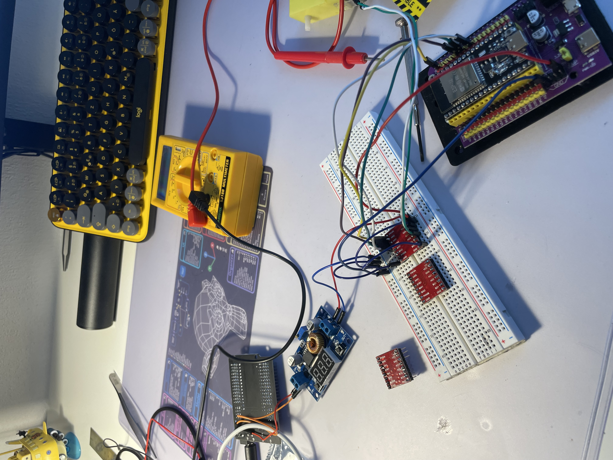
 
<em>14.03.2026 — Erster erfolgreicher Motor-Test: Ersatz-TB6612FNG gelötet, Motor läuft</em>

 

**Ausblick**
- Weitere Motoren ansteuern  
- Erste kleine Fahrtests durchführen

## 2026-03-15 – Raspberry Pi Setup & Robotergehäuse-Finalisierung

**Ziel**
- Robotergehäuse-Design fertigstellen (bis auf Deckel)  
- Raspberry Pi 5 einsatzbereit machen  
- Kamera-Setup für YOLOv8 prüfen  
- Energieversorgung für Raspberry Pi evaluieren  

**Vorgehensweise**
- Robotergehäuse vollständig in CAD ausgearbeitet (Deckel noch offen)
- Teile erneut gedruckt, Toleranzen getestet, iterative Anpassungen durchgeführt  
- Raspberry Pi OS installiert  
- Roboter offiziell auf den Namen **ORKA** getauft und Logo erstellt 
- Günstiges Pi-Kameramodul überprüft → Adapter für Pi 5 fehlt  
- Powerpack getestet → ungeeignet für Pi 5, da Stepper deutlich mehr Strom ziehen als ursprünglich angenommen  

**Probleme**
- Netzteil für Raspberry Pi 5 noch nicht vorhanden  
- Kameramodul inkompatibel mit Pi 5
- Powerpack liefert nicht ausreichend Strom für Raspberry Pi + Stepper-Motoren  
- Unklar ob Kamera-Modul ausreichend für gute Bilderkennung

**Lösungen**
- Raspberry Pi AI-Kamera-Modul bestellen, um flüssige Bildrate zu gewährleisten,  
- Dediziertes Netzteil für Raspberry Pi bestellen 
- Toleranzen laufend geprüft und optimiert  

**Erkenntnisse**
- Robotergehäuse-Design bis auf Deckel finalisiert, iterative Druck-Tests notwendig für präzise Passform  
- Kamera-Kompatibilität und Performance frühzeitig prüfen  

**Ausblick**
- Netzteil für Raspberry Pi besorgen  
- KI-Kamera testen und integrieren  
- Deckel für Robotergehäuse designen  
- Weitere Toleranztests an Robotergehäuse und Druckteilen durchführen

## 2026-03-16 – Corner Pieces, Heat Inserts & Druck-Toleranzen

**Ziel**
- Corner Pieces für Robotergehäuse weiter ausarbeiten  
- Heat Inserts Löcher anpassen  
- Druck-Toleranzen prüfen und optimieren  

**Vorgehensweise**
- Mutterlochgröße angepasst → von ursprünglich 56 mm auf 54 mm verkleinert  
  - Erfordert etwas Kraft beim Versenken, hält aber sehr gut  
  - Alternative 54,5 mm geprüft, ebenfalls passend, Entscheidung für 54 mm zur sicheren Fixierung  
- Iterative Anpassung der Toleranzen für Schienen an den Wänden → wiederholtes Drucken, Testen, erneutes Modellieren  
- Druck gestartet für Corner Pieces, um Robotergehäuse fertigzustellen  
- Restliche Dateien für Druck vorbereitet  
- Über Druckausrichtung nachgedacht → Optimierung für Optik und Stabilität  

**Probleme**
- Toleranzen kritisch → wiederholtes Drucken notwendig
- Großes Modell → lange Ladezeiten bei Anpassungen im CAD  
- Heat Inserts zunächst falsche Lochgröße → Anpassung notwendig  

**Lösungen**
- Mutterloch auf 54 mm reduziert → sichere Fixierung gewährleistet  
- Iteratives Drucken und CAD-Anpassung → optimale Passform der Corner Pieces  
- Werkzeuge ergänzt: Lötstation, Hand-Akkuschrauber → effizienterer Zusammenbau  

**Erkenntnisse**
- Präzise Toleranzen entscheidend für modulare Robotergehäuse-Struktur  
- Testdrucke und iterative Anpassungen sparen später Zeit beim finalen Zusammenbau  
- Effiziente Werkzeuge erleichtern Montage deutlich  

**Ausblick**
- Robotergehäuse vollständig montieren  
- Deckel designen und Toleranzen prüfen  
- Weitere Testdrucke durchführen

## 2026-03-17 – Kamera-Modul zurückgeschickt, Robotergehäuse-Flaw erkannt

**Ziel**
- KI-Kamera-Modul in Betrieb nehmen
- Robotergehäuse erstmals physisch zusammenbauen und evaluieren

**Vorgehensweise**
- Raspberry Pi AI Camera (IMX500) getestet
- Robotergehäuse zum ersten Mal zusammengebaut — Modularität in der Praxis geprüft

**Probleme**
- KI-Kamera hat keinen Autofokus → für ORKAs geplanten Use-Case (variable Abstände, Arm-Targeting) nicht geeignet
- Beim ersten Zusammenbauen: Mittelteile werden bei Erweiterung des Systems nicht ineinander passen — Modularität eingeschränkt

**Lösungen**
- Kamera zurückgeschickt, Alternative gesucht
- Design-Anpassungen für sauberere Modularität abgeleitet

**Erkenntnisse**
- Frühes physisches Zusammenbauen deckt Probleme auf, die im CAD unsichtbar bleiben
- Lieber etwas länger recherchieren und Komponenten gezielt auswählen, statt vorschnell zu bestellen und später Zeit durch Fehlkäufe, Rücksendungen oder Umplanungen zu verlieren
  
**Ausblick**
- Alternative Kameralösung recherchieren

---

## 2026-03-18 – Vision-Architektur entschieden, Corner-Geometrie verbessert

**Ziel**
- Geeignetere Kameralösung auswählen
- Mechanische Erweiterbarkeit des Robotergehäuse-Systems verbessern

**Vorgehensweise**
- USB-Webcam vs. Raspberry Pi Camera Module 3 abgewogen
- Entscheidung für Raspberry Pi Camera Module 3: sauberere CSI-Integration, kein USB-Overhead, Autofokus vorhanden
- Hailo-8L M.2 HAT (13 TOPS) für Pi 5 bestellt — für schnellere YOLO-Inferenz
- Corner Pieces weiter iteriert und angepasst

**Probleme**
- Wände könnten ohne Deckel nach oben wegrutschen (Räder ragen seitlich heraus)

**Lösungen**
- Leisten die darüber festgeschraubt werden — mechanischer Anschlag für Wände nach oben

**Ausblick**
- Kamera-Modul abwarten, Wände weiter testen

---

## 2026-03-19 – Robotergehäuse erstes Mal zusammengebaut, Connector-Test & Hailo-8L Integration

**Ziel**
- Robotergehäuse vollständig physisch zusammenbauen
- Connector-System in der Praxis testen
- Hailo-8L M.2 HAT in Betrieb nehmen

**Vorgehensweise**
- Alle Stützen, Baseplate und Gridfinity-Baseplate zum ersten Mal komplett zusammengeschraubt
- Wände gedruckt und eingesetzt
- Connectoren zwischen Wand-Modulen getestet
- Hailo-8L M.2 HAT an Pi 5 angeschlossen und in Betrieb genommen — Hardware-Beschleunigung für YOLO-Inferenz aktiv

**Probleme**
- Connectors sitzen sehr eng → Demontage nur mit Zange möglich

**Lösungen**
- Enge Connectors bewusst akzeptiert: feste Verbindung hat für Outdoor-Einsatz Vorrang vor einfacher Demontage
- Zange als Standard-Demontagewerkzeug festgelegt

**Erkenntnisse**
- Erstes vollständiges Zusammenbauen zeigt: Konzept funktioniert mechanisch
- Connector-Enge ist ein bewusster Trade-off — Stabilität vs. Wartbarkeit

**Ausblick**
- Kamera-Modul in Betrieb nehmen
- YOLOv8 auf Pi aufsetzen

---

## 2026-03-20 – Kamera in Betrieb, YOLOv8 installiert

**Ziel**
- Raspberry Pi Camera Module 3 in Betrieb nehmen
- YOLOv8 auf Pi 5 lauffähig machen

**Vorgehensweise**
- Kamera-Modul direkt über CSI angeschlossen
- Kamera über picamera2 / libcamera erfolgreich gestartet
- YOLOv8 (ultralytics) in venv `ORKA-env` auf Pi 5 installiert — erstes Inferenz-Test erfolgreich
- Wall Holder für Motorwand entworfen
- Erstes Rad-Design gedruckt und montiert

**Probleme**
- Erstes Rad-Design nicht optimal: Abstand zwischen Rad und Motorwand zu groß, Raddurchmesser zu klein → leichtes Schleifen ohne TPU-Reifen

**Lösungen**
- Rad-Iteration für folgende Tage eingeplant

**Ausblick**
- Rad-Design überarbeiten
- Motor-Wand-Halter weiterentwickeln

---

## 2026-03-23 – Motor-Wand erste Versuche

**Ziel**
- Konzept für DC-Motor-Montage an Wand entwickeln

**Vorgehensweise**
- Erste Designs für Motor-Wand-Halterung erstellt
- Iterative Anpassungen, Testdrucke gestartet

**Probleme**
- Geometrie zwischen Motor und Wand noch nicht gefunden. Kleinigkeiten nicht eingeplant

**Lösung** 
- Geometrie zwischen Motor und Wand ausgebessert

**Erkenntnisse**
- Motorhalterung erfordert mehr Iterationsaufwand als erwartet

---

## 2026-03-24 – Motor-Wand finalisiert & Rad-Iteration

**Ziel**
- Motorwand-Design abschließen, Raddurchmesser anpassen

**Vorgehensweise**
- Motor-Wand vollständig in CAD ausgearbeitet: DC-Motoren können sauber an Chassis-Wand montiert werden
- Raddurchmesser erhöht, um Abstand zwischen Rad und Motorwand zu verringern
  
 

<h3><strong><u>📸 Fotos anzeigen</u></strong></h3>

 

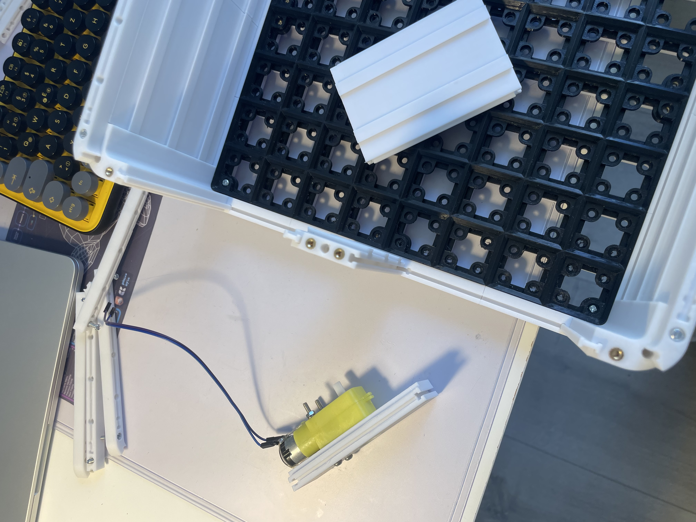
 
<em>24.03.2026 — Motorwand finalisiert: DC-Motor sauber an Chassis-Wand montiert</em>

 

**Probleme**
- Abstand Rad–Motorwand in vorherigen Iterationen zu groß → Instabilität

**Lösungen**
- Raddurchmesser erhöht → Abstand reduziert, Bodenauflage verbessert

**Erkenntnisse**
- CAD-Maße und reale Montage-Toleranzen weichen ab — iteratives Drucken und Messen ist effizienter als reines CAD-Optimieren

**Ausblick**
- Räder montieren, Gesamtsystem verkabeln, ersten Fahrtest vorbereiten

---

## 2026-03-25 – Erste Fahrt von ORKA 🏁
> **Milestone erreicht — ORKA fährt.**

**Ziel**
- Räder finalisieren, System vollständig verkabeln, ersten echten Fahrtest durchführen

**Vorgehensweise**
- Radabstand zu Wand nochmals minimal angepasst — Abstand nach vorherigem Druck noch leicht zu eng
- Alle vier DC-Motoren vollständig verkabelt (ESP32 → TB6612FNG → 4× Motoren)
- **Erster echter Fahrtest auf dem Boden — alle vier Räder, vorwärts/rückwärts**
- Kamera-Gehäuse für Pi v1, Pi v3 parallel gedruckt
- Einfaches Python-Script auf Pi entwickelt: Verbindung per IP, Live-Kamerabild und Steuerung über Browser

**Probleme**
- Lenkung (Links/Rechts) noch nicht korrekt — vorwärts/rückwärts funktionierte, Richtungssteuerung fehlerhaft

**Lösungen**
- Lenkfehler für den nächsten Tag zurückgestellt — Milestone "erstes Fahren" war das Tagesziel
- Stromversorgung Pi: Powerpack → AC-Ausgang → Netzteil → Pi 5 — nicht die eleganteste Lösung, aber Powerpack bereits vorhanden und Kapazität sehr gut. 

**Erkenntnisse**
- Erster Fahrtest bestätigt: Motorsteuerung (ESP32 + TB6612FNG), Stromversorgung und mechanische Integration funktionieren zusammen
- Iterative Rad- und Wand-Anpassungen über mehrere Tage haben sich ausgezahlt
- Python-basierte Web-Steuerung über IP funktioniert — Kamerabild und Fahrbefehle im Browser
  
 

<h3><strong><u>📸 Fotos anzeigen</u></strong></h3>

 

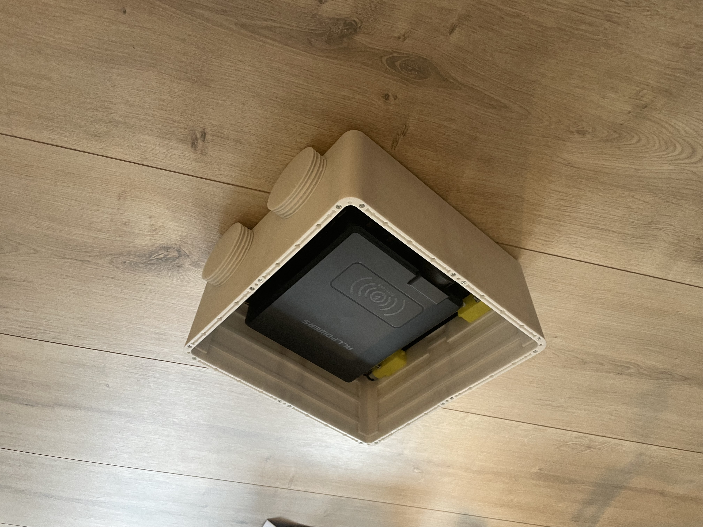
 
<em>25.03.2026 — Erstes Zusammenbauen mit Rädern</em>

 

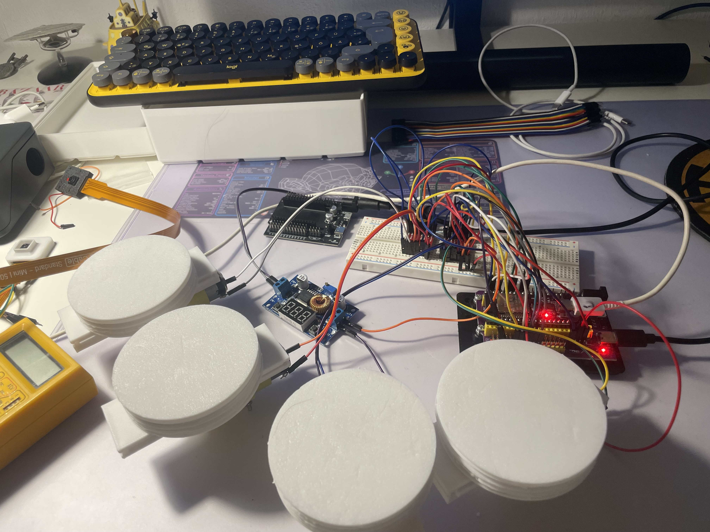
 
<em>25.03.2026 — Rad und Motor Test vor erster Fahrt</em>

 

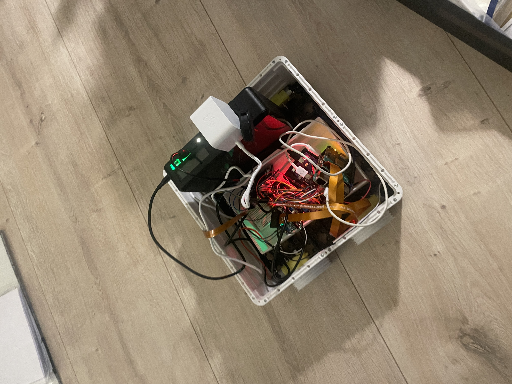
 
<em>25.03.2026 — Erste Fahrt: alle vier Räder, vorwärts/rückwärts</em>

 

**Ausblick**
- Lenkfehler (Links/Rechts) debuggen und beheben

---

## 2026-03-26 – Lenkung debuggt & behoben

**Ziel**
- Links/Rechts-Steuerung korrekt zum Laufen bringen

**Vorgehensweise**
- Systematisches Debugging: Kombination aus falscher Pin-Zuordnung im Code und falsch angeschlossenen Motorkabeln identifiziert
- Motorkanäle einzeln durchgetestet bis Drehrichtung mit Steuerlogik übereinstimmte
- Pin-Mapping im Code dokumentiert

**Probleme**
- Fehler war auf zwei Ebenen gleichzeitig: Code (Pin-Logik) und Hardware (Kabelzuordnung) — erschwertes Debugging

**Lösungen**
- Einzelkanal-Testing als Methode: einen Motor nach dem anderen auf korrekte Drehrichtung prüfen

**Erkenntnisse**
- Bei Lenkfehlern immer beide Ebenen prüfen: Software-Pin-Logik **und** Kabel-Richtung — einer allein reicht häufig nicht
- Robotergehäuse-Erweiterung gedruckt: System stabil genug

 

<h3><strong><u>📸 Fotos anzeigen</u></strong></h3>

 

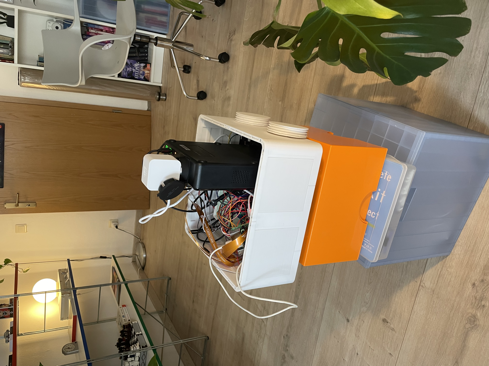
 
<em>26.03.2026 — Debugging Links/Rechts-Steuerung: Pin-Logik und Kabelzuordnung</em>

 

---

