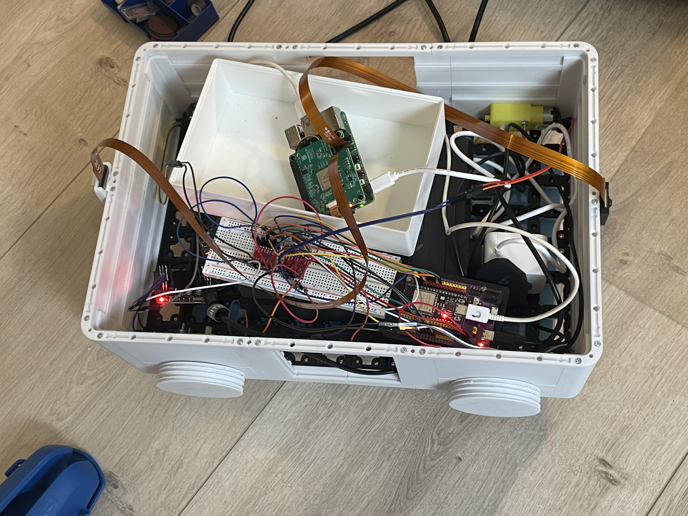

# ORKA — Omnidirektionaler Roboter mit Kameragestützter Autonomie

<p align="center">
  <picture>
    <source media="(prefers-color-scheme: dark)" srcset="assets/logo/ORKA_logo_white.png">
    <source media="(prefers-color-scheme: light)" srcset="assets/logo/ORKA_logo_black.png">
    
  </picture>
</p>

> Autonomous mobile robot platform with computer vision, modular chassis design, and a 6-DOF robotic arm.
> Built as an engineering portfolio project. Currently in active development.

---

<br>

<details>
<summary><h3><strong><u>📸 Fotos anzeigen</u></strong></h3></summary>
<br>
<p align="center">

<br>
<em>ORKA interior: Raspberry Pi 5 (8GB), ESP32, 2× TB6612FNG motor drivers, Hailo-8L M.2 HAT (13 TOPS) — all systems active</em>
</p>
</details>

<br>

---

## What is ORKA?

ORKA is a self-built autonomous robot designed for outdoor object detection and collection using YOLOv8 and a robotic arm. The platform is intentionally modular — the mission payload (arm, sensors, gripper) can be swapped independently of the drive platform.

Current status: **driving, camera live, YOLOv8 running on-device.**


## Architecture

```
Raspberry Pi 5 (8GB)  ──UART──►  ESP32
   │                                │
   │ picamera2 / CSI                └──► 2× TB6612FNG ──► 4× DC Motors
   │ YOLOv8 (orca-env)
   │
   └──► Hailo-8L M.2 HAT (13 TOPS — active)
        [planned] 2nd ESP32 — sensors (GPS, IMU, ultrasonic)
        [planned] Robotic Arm (Robotastic 6R, NEMA steppers, SimpleFOC)
        [planned] GPS · IMU · LiDAR
        [long-term] Legged platform — quadruped
```

**Key design decisions:**
- ESP32 handles real-time motor control (deterministic, no Linux overhead)
- Pi 5 handles vision and high-level logic
- Chassis uses a Gridfinity + DIN-rail hybrid system (Robofinity) for modular electronics mounting

---

## Tech Stack

| Layer | Technology |
|---|---|
| Vision / AI | YOLOv8 (ultralytics), picamera2, Raspberry Pi Camera Module 3, Hailo-8L M.2 HAT (13 TOPS) |
| Compute | Raspberry Pi 5 8GB, ESP32 DevKit |
| Motor Control | TB6612FNG × 2, custom ESP32 firmware (Arduino) |
| Chassis | 3D-printed PETG, Gridfinity + DIN-rail hybrid (Robofinity) |
| CAD | Siemens NX |
| 3D Printing | Bambu Lab P1S |

---

## Roadmap

- [x] Drive platform — 4-wheel, ESP32-controlled, UART interface to Pi
- [x] Camera live — Raspberry Pi Camera Module 3 via CSI
- [x] YOLOv8 running on Pi 5 (8GB)
- [x] Hailo-8L M.2 HAT integration — 13 TOPS hardware-accelerated inference
- [ ] Robotic arm — Robotastic 6R (6-DOF, NEMA steppers, SimpleFOC / CAN-Bus)
- [ ] Sensor expansion — 2nd ESP32 for GPS, IMU, ultrasonic (TBD)
- [ ] TACO dataset fine-tuning — outdoor trash detection
- [ ] Autonomous pick-and-place mission
- [ ] Robofinity — release modular mounting system on Printables
- [ ] Legged platform — long-term vision: ORKA as a quadruped robot

---

## Engineering Log

Development decisions, hardware failures, and lessons learned are documented in [`DEVLOG.md`](DEVLOG.md).

---

*Built by [Lenny Kossyk](mailto:lenkossyk@gmail.com) · TH Nürnberg · Energieprozesstechnik*